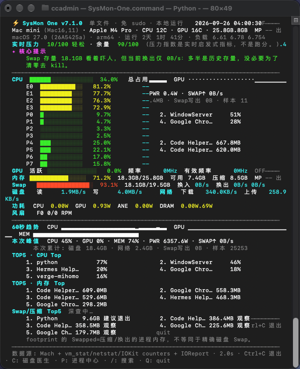

# SysMon One

**超级轻量系统监控 · An ultralight system monitor**

**监控 · 诊断 · 清理**  
**Monitor · Diagnose · Clean**

Windows 版本约 **20KB**，macOS 版本保持在 **100KB 以内**。

无需安装，不需要账号，不常驻后台，不上传遥测数据。

SysMon One 用一个极小的本地文件直接显示 CPU、GPU、内存、Swap、磁盘、网络、功耗、风扇和进程状态，同时尝试告诉你哪些数字真正值得处理。

**你的电脑不缺数字，缺的是有人告诉你哪些数字值得管。**

---

The Windows version is roughly **20KB**, while the macOS version stays **under 100KB**.

No installation, no account, no background daemon and no telemetry.

SysMon One uses a tiny local file to show CPU, GPU, memory, swap, disk, network, power, fans and running processes, while also trying to explain which numbers actually require attention.

**Your computer already has enough numbers. SysMon One tells you which ones matter.**

---

## 界面案例 / Screenshot

---

## 为什么做 SysMon One

很多系统监控工具能告诉你：

> Swap：18.6GB

但对于普通用户来说，更重要的问题其实是：

> 这正常吗？  
> 我要不要关闭程序？  
> 是哪个程序造成的？  
> 我的电脑为什么卡？  
> 我的磁盘空间到底去哪了？

SysMon One 希望把系统监控从“展示数字”向前推进一步。

例如，当 Swap 已经很高，但当前 Swap-out 为 0B/s、Memory Pressure 仍然正常时，它会告诉你：

> 这更可能是历史 Swap 存量。当前没有持续换出，没有必要为了把数字清零而结束应用。

它不会因为一个数字看起来很大，就制造一个红色“严重警告”。

---

## Why SysMon One

Many system monitors can tell you:

> Swap: 18.6 GB

But most users actually want to know:

> Is that bad?  
> Do I need to close anything?  
> Which process caused it?  
> Why is my computer slow?  
> Where did all my disk space go?

SysMon One tries to go one step beyond displaying telemetry.

For example, if swap usage is high but current swap-out is 0 B/s and memory pressure remains normal, SysMon One may tell you:

> This is probably historical swap usage. There is no active swapping pressure, so there is no reason to terminate applications just to make the number smaller.

A large number alone should not automatically become a red warning.

---

## 功能 / Features

### Monitor · 监控

- CPU 总占用与逐核心占用
- GPU 状态
- Memory / 内存
- Swap 与实时 Swap I/O
- Disk I/O / 磁盘读写
- Network / 网络
- Power / 功耗
- Battery / 电池
- Fan / 风扇
- Hardware & OS information / 硬件与系统信息
- Session peaks / 本次运行峰值
- 60 秒趋势

### Diagnose · 诊断

- macOS Memory Pressure
- Swap 状态分析
- CPU / RAM 高占用进程
- 人话提示
- 判断“是否真的需要处理”
- 当前系统压力与余量

### Process Tools · 进程工具

- Process tree / 进程树
- CPU / RAM Top processes
- Process search / 进程搜索
- Safe terminate / 安全结束进程
- Critical system process protection / 系统关键进程保护
- 强制 Kill 前二次确认

### Storage Doctor · 磁盘诊断与清理

- 磁盘占用概览
- 大文件识别
- Downloads / 安装包 / 压缩包
- 开发工具缓存
- AI 模型空间
- 可安全清理项目
- 需要人工检查的项目
- 个人数据保护

---

## Tiny by design · 超级轻量

SysMon One deliberately avoids turning a simple monitoring task into another heavyweight background application.

| Platform | Main file |
|---|---:|
| Windows | ~20KB `.cmd` |
| macOS | <100KB `.command` |

Windows uses the PowerShell already included with the operating system.

The macOS build keeps the project as a single executable script and uses native system interfaces and built-in tools where possible.

---

SysMon One 有意保持极小。

查看一次 CPU、Swap 或磁盘状态，不应该先安装几百 MB 的“系统优化软件”，更不应该因此获得新的后台进程、账号系统和广告。

Windows 主程序目前约 **20KB**。

macOS 主程序保持在 **100KB 以内**。

---

## Platform status · 平台状态

### macOS

当前主线已经在 Apple Silicon 真机进行测试。

主要能力包括：

- Apple Silicon CPU / GPU monitoring
- DVFS related telemetry where available
- Power information
- Memory / Swap
- Fan readout where supported
- Process Center
- Storage Doctor

Unsupported hardware telemetry is shown as `N/A` rather than fabricated.

### Windows

Windows version is currently **Beta**.

It is implemented as a single `.cmd` file and uses the PowerShell environment included with Windows.

Main capabilities include:

- CPU
- Memory
- Disk
- Network
- Process Center
- Process Search
- Process termination
- Storage Doctor
- Fan information where exposed by Windows, the OEM, LibreHardwareMonitor or OpenHardwareMonitor

Windows hardware sensors vary significantly between manufacturers, so unavailable values may display as `N/A`.

---

## Quick Start · 快速开始

### macOS

1. 从 GitHub Releases 下载 macOS ZIP
2. 解压
3. 双击 `SysMon-One.command`

主要快捷键：

| Key | 功能 |
|---|---|
| `C` | Storage Doctor / 磁盘医生 |
| `P` | Process Center / 进程中心 |
| `/` | Search Process / 搜索进程 |
| `Q` | Quit / 退出 |

如果 macOS 阻止第一次运行：

`系统设置 → 隐私与安全性 → 仍要打开`

### Windows

1. 从 GitHub Releases 下载 Windows ZIP
2. 解压
3. 双击 `SysMon-One-Windows.cmd`

Windows 不需要额外安装 Python。

---

## Safety · 安全原则

SysMon One 不安装后台服务，不要求账号，不上传遥测数据。

磁盘清理遵循一个简单原则：

> **只自动处理可重建、可解释、低风险的数据。**

以下个人数据不会进入自动清理路径：

- Desktop
- Documents
- Photos
- iCloud Drive
- Mail
- Messages

Downloads、手机备份、AI 模型、Docker 数据等可能占用大量空间的内容，只进入人工检查，不自动删除。

进程结束功能同样遵循安全边界：

- 保护关键系统进程
- 普通进程优先正常退出
- 强制 Kill 需要再次确认

---

SysMon One installs no background service, requires no account and sends no telemetry.

Automatic cleanup follows one rule:

> **Only remove data that is rebuildable, explainable and low-risk.**

Personal data such as Desktop, Documents, Photos, iCloud Drive, Mail and Messages is never part of the automatic cleanup path.

Potentially important data such as Downloads, device backups, AI models and Docker data is shown for manual review only.

Process termination also follows a conservative model:

- critical system processes are protected
- normal termination is attempted first
- force kill requires explicit confirmation

---

## Created by · 创作者

**Soulite Magic · Andrew Yang · up-ai**

---

## License

MIT License — see [LICENSE](LICENSE).

---

## 支持项目

**编程不易，欢迎打赏。**

---

## Support

**Coding takes work. Donations are welcome.**

